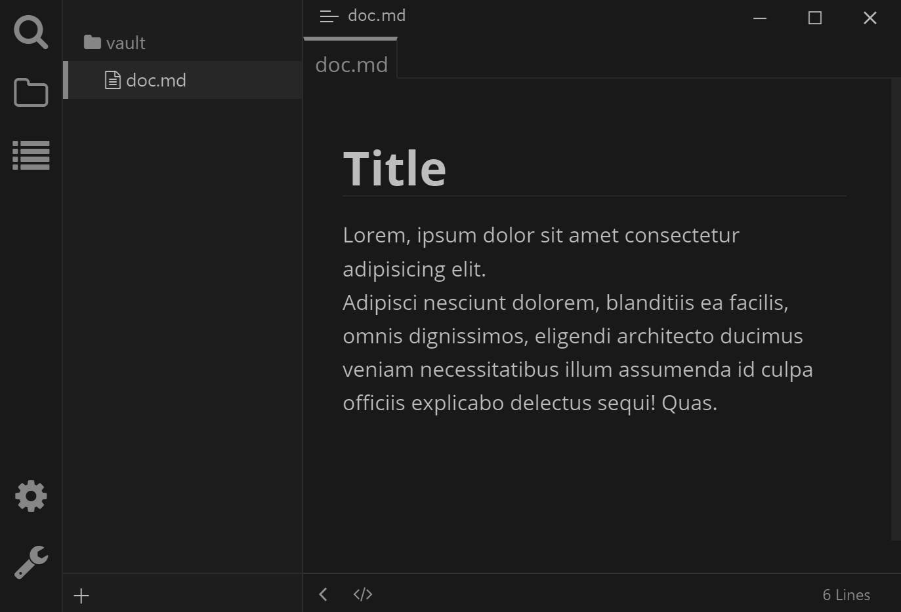
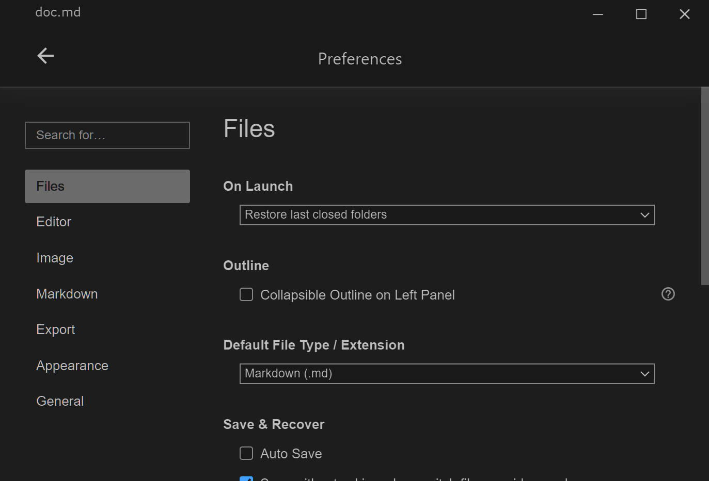

# Typora Plugin Dark Mode

English | [简体中文](./README.zh-CN.md)

This a plugin based on [typora-community-plugin][core] for [Typora](https://typora.io).

General dark mode for any theme.

- Use in Command Panel (Press <kbd>F1</kbd>)
- Press the status bar button

## Preview

| **Dark Github**                        | **Dark Whitey**                           |
| :------------------------------------: | :---------------------------------------: |
|           |              |
| **Dark Github - Settings Modal**       | **Dark Github - App Settings**            |
|  |  |

## Install

1. Install [typora-community-plugin][core]
2. Open "Settings -> Plugin Marketplace" search "Dark Mode" then install it.

[core]: https://github.com/typora-community-plugin/typora-community-plugin
