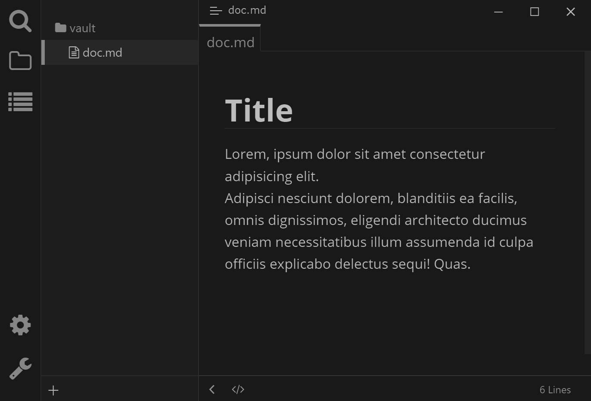
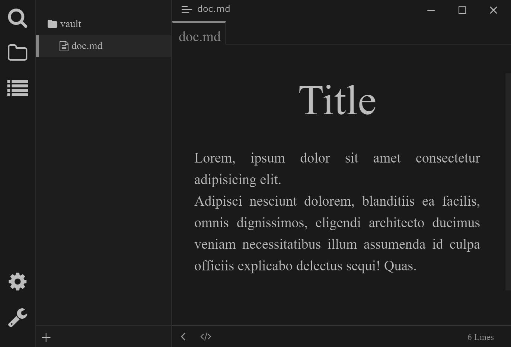
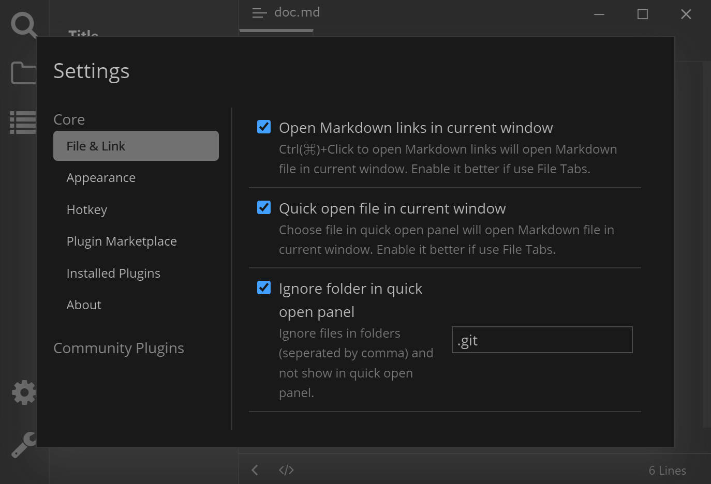
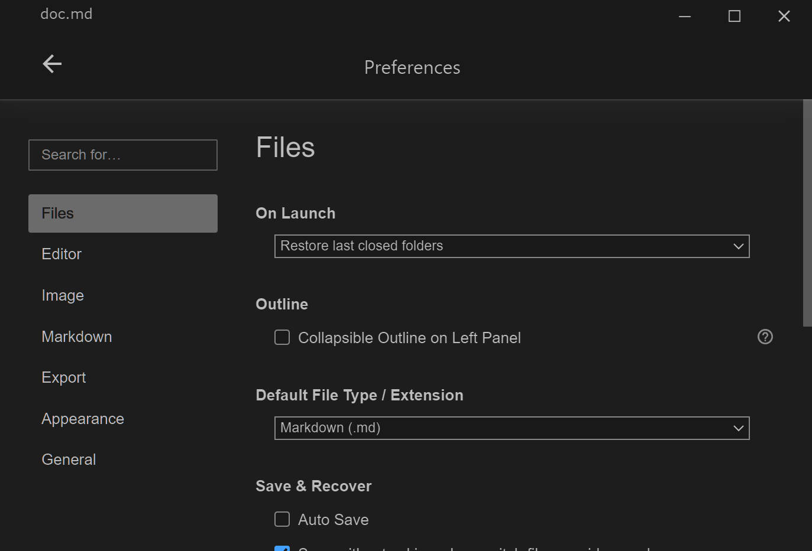

# Typora Plugin Dark Mode

[English](./README.md) | 简体中文

这是一个基于 [typora-community-plugin][core] 开发的，适用于 [Typora](https://typora.io) 的插件。

适用于任意亮色主题的暗黑模式。

- 在命令对话框（按 <kbd>F1</kbd> 打开）中启用/禁用

## 预览

| **暗黑模式 Github 主题**                 | **暗黑模式 Whitey 主题**                    |
| :------------------------------------: | :---------------------------------------: |
|           |              |
| **暗黑模式 Github 主题- 设置对话框**       | **暗黑模式 Github 主题 - 应用设置**           |
|  |  |

## 安装

1. 安装 [typora-community-plugin][core]
2. 在 “设置 -> 插件市场” 中搜索 “Dark Mode” 并安装

[core]: https://github.com/typora-community-plugin/typora-community-plugin
